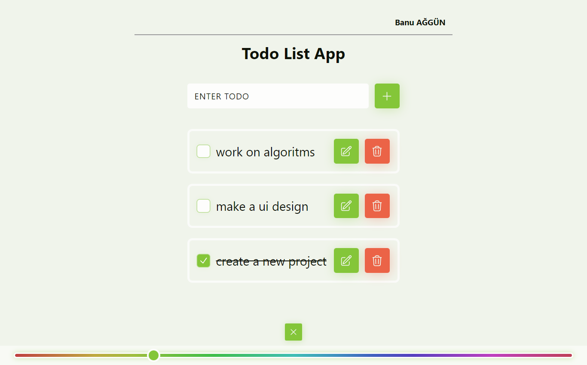

# React Todo App

  ✅ Cloning the project from [MockApi](https://mockapi.io/)

  ✅ This cloned project allows to create an endpoint endpoint for the Api

  ✅ Username is taken from user, and stored in local storage

  ✅ CRUD (Create, Read, Update, Delete) Operations did on Todo List

  ✅ When adding a new todo, the input field should not be empty, it should contain at least 3 characters

  ✅ Storing the user's dark/light mode preference in local storage

  ✅ Additionally I added Color Picker. In this way, the user can change the theme.

## Technologies & Libraries

> React

> Axios

> Heroicons

### Screenshots

